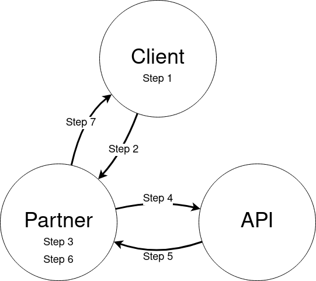
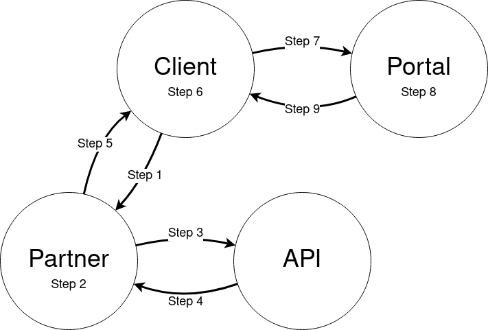
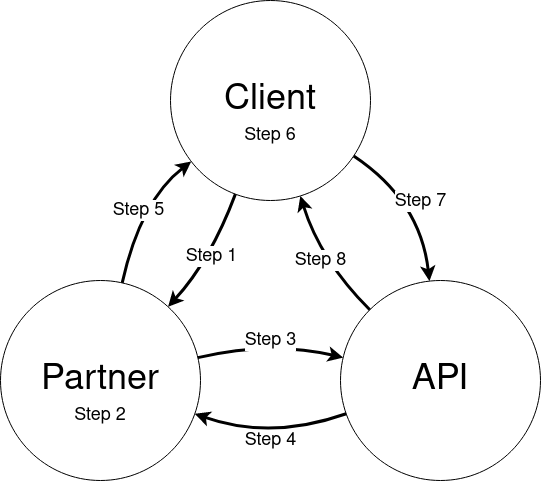

# Client-side Direct API Usage

The usual way of making an authenticated request to the SnapTrade API is to sign the request using the consumer key provided at sign up, storing the signature in the Signature header. However, since the signature-based authentication requires requests to be made from a backend server (so that the consumer key remains a secret), it might not be suitable for certain use cases.

In particular, some apps want their users to be able to talk to the SnapTrade API directly, so that user data does not pass through the app's server backend. This model can reduce development time on behalf of the app, reduce liability associated with having access to sensitive user data, and improve performance by removing the need for the app's server to intermediate all communication with the SnapTrade API.

We refer to this model as "client-side direct API", in which client-side code makes direct requests to SnapTrade's API on behalf of a registered user. This is implemented by allowing partners to obtain encrypted access tokens which would be decrypted and stored in a user's local device. The user's device then makes requests to the SnapTrade API using the decrypted access token. This approach uses public key cryptography to securely pass the access token to the user and prevent even partners from receiving the decrypted token.

## Communication Flow

There are three main parties involved in this communication pattern:

- The user running a client-side application on their personal device -- "The Client"
- The partner company running an authentication backend on their server that allows the user to login and controls access to the application's features -- "The Partner"
- The SnapTrade API that facilitates access to the user's brokerage account data -- "The API"

In addition, there is also the SnapTrade Connection Portal ("The Portal") which is a hosted web application that The Client must visit in order to connect accounts or modify their existing connections.

The following three sections describe the communication patter for registering a new user, generating a link to the SnapTrade Connection Portal so that The Client can connect accounts, and generating a client-side access token so that The Client can communicate directly with The API to access account information and trade. Once The Client has received its access token, The Partner will not need to intermediate requests to The API until a new access token is required.

To better understand the process, you can follow along each of the steps with the visual diagram that is provided for each process.

### Registration

The typical flow for registering a new user for client-side direct API usage is as follows:

1. The Client generates an RSA public/private keypair and stores it locally. Important: the private key MUST be kept locally on the client device! This is what's used for decrypting access tokens for The API.
1. The Client sends a message to The Partner indicating that it would like to register with SnapTrade. This message includes The Client's public RSA key that was generated in the previous step (not the private key!).
1. The Partner authenticates the request and confirms that The Client has permission to register an account with SnapTrade.
1. The Partner sends a request to The API at the :api[Authentication_registerSnapTradeUser] endpoint, including the desired `userId` as well as the `rsaPublicKey`.
1. The API confirms the new user registration and responds to The Partner with the `userSecret`.
1. The Partner stores the `userSecret` to be associated with their client.
1. The Partner sends a message to The Client confirming the success.



### Connecting an account

At this time, the user may wish to connect their first account. The typical flow is as follows:

1. The Client sends a message to The Partner requesting to connect an account.
1. The Partner authenticates the request and confirms that The Client has previously been registered with SnapTrade.
1. The Partner sends a request to the :api[Authentication_loginSnapTradeUser] endpoint with the appropriate `userId` and `userSecret`.
1. The API responds to The Partner with an encrypted response that contains the login link. The response is encrypted using The Client's public key and can only be decrypted using The Client's private key.
1. The Partner responds to The Client and passes along the encrypted payload that it received from The API.
1. The Client uses its private key to decrypt the payload and reveal the login redirect link.
1. The Client opens the login redirect link in a browser tab or a webview.
1. The Client is automatically authenticated with the SnapTrade Connection Portal and is granted access to add/remove connections to their account.
1. After successfully modifying their connections, the user is returned to The Client application.



### Accessing the SnapTrade API directly

At this point, The Client can begin to pull their account information directly from The API. A typical flow for accessing The API directly is as follows:

1. The Client sends a message to The Partner requesting an access token for The API.
1. The Partner authenticates the request and confirms that The Client has previously been registered with SnapTrade.
1. The Partner sends a request to the :api[Authentication_getUserJWT] endpoint with the appropriate `userId` and `userSecret`.
1. The API responds to The Partner with an encrypted response that contains the access token. The response is encrypted using The Client's public key and can only be decrypted using The Client's private key.
1. The Partner responds to The Client and passes along the encrypted payload that it received from The API.
1. The Client uses its private key to decrypt the payload and reveal the access token.
1. The Client sends a request to The API using the access token.
1. The API verifies that the access token is valid and returns the requested information associated with the authenticated user. The Client may use this access token as needed until it expires. At any point, The Client may request a new access token by repeating the steps in this process.




## RSA Key Pair
As part of Step 1 in the Registration flow, the partner is expected to generate an RSA key pair on the user's local device. The key pair consists of a private key and a public key.

The private key must be stored on the user's local device, and will be used to decrypt encrypted messages from the SnapTrade server.

The public key must be added as part of the request while registering a user on SnapTrade. See the documentation for registering users for more details. The public key will be used to encrypt messages from the server to the user's local device.

The SnapTrade server expects the RSA public key to be in the OpenSSH format like so:

```
ssh-rsa AAAAB3NzaC1yc2EAAAADAQABAAABAQCp65KkPod0ET8NG9hHWqpGAEzXaKWA2msoBA8s2zVjjLbjdYb8ZMVFuwpK3iaStz2knZBxfqaySAAV4TCMBt2uG335PeQ268tGaySWTgvYdU15xVfwwY+gPVg3SgrjeyyVYakvUjiVThfStbRhKjNGVPG5JFsQB+TwqhLl8sPvfMj39PHDxV7wllHx2L4JPWO9vIaSU/LHUC9RlDtyyzoCLBLvcljyAQejMOZ942mKOcCz7S5KPAaxLR1lUWOJ6b/IdEjLxxgrhw4lXWhhnOMlTvqx5mQ4/JaBnKlWt8nsdawZ2uEkRWcRsYf2QViPv9FkL9R54BmuqU3fz2+52VsB
```

### Decrypting encrypted messages

Encrypted messages from SnapTrade consist of two parts:

1. an encrypted shared key which was encrypted using a users RSA public key, and
1. the actual message which was encrypted using the shared key.


#### Decrypting the encrypted shared key
The user's local device should be able to decrypt the shared key using the private RSA key that came from the RSA key pair generated earlier.

Below is an example code (in Python) for decrypting the encrypted shared key.

```python
def decrypt_rsa_message(self, encrypted_message):
    from Crypto.Cipher import PKCS1_OAEP
    from Crypto.PublicKey import RSA
    from base64 import b64decode

    f = open('private.pem', 'r')
    private_key = RSA.import_key(f.read())
    cipher = PKCS1_OAEP.new(private_key)

    return cipher.decrypt(b64decode(encrypted_message.encode())).decode()
```

#### Decrypting the encrypted shared message
The encrypted message was encrypted using the shared key that was decrypted from the previous step in the AES Mode-OCB. The user's local device uses that key to decrypt the message. In this particular instance, it the shared key is used to obtain the decrypted access token.

The code below is an example (in Python) of how to decrypt the message using the shared key.

```python
def decrypt_aes_message(self, shared_key, encrypted_message):
    from Crypto.Cipher import AES
    from base64 import b64decode

    encrypted_msg = b64decode(encrypted_message["encryptedMessage"].encode())
    tag = b64decode(encrypted_message["tag"].encode())
    nonce = b64decode(encrypted_message["nonce"].encode())
    cipher = AES.new(shared_key.encode(), AES.MODE_OCB, nonce=nonce)

    return cipher.decrypt_and_verify(encrypted_msg, tag).decode()
```

### Making requests using access tokens

The access tokens used to make client-side requests to the SnapTrade API are
implemented as JWT tokens. To make a request from a user's local device using a
JWT, the key-value pair of `Authorization: JWT {decrypted token}`` should be added
to the request headers. The `Signature`` header, as well as the `timestamp`` and
`userId`` query params are no longer required.