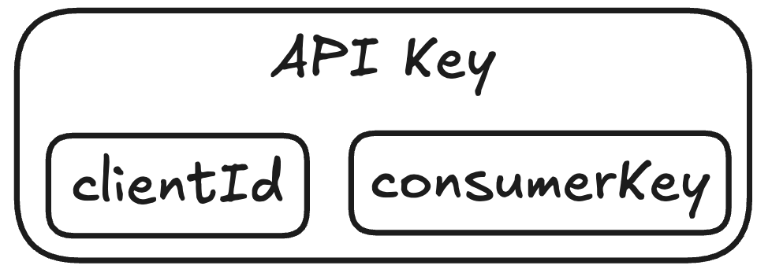
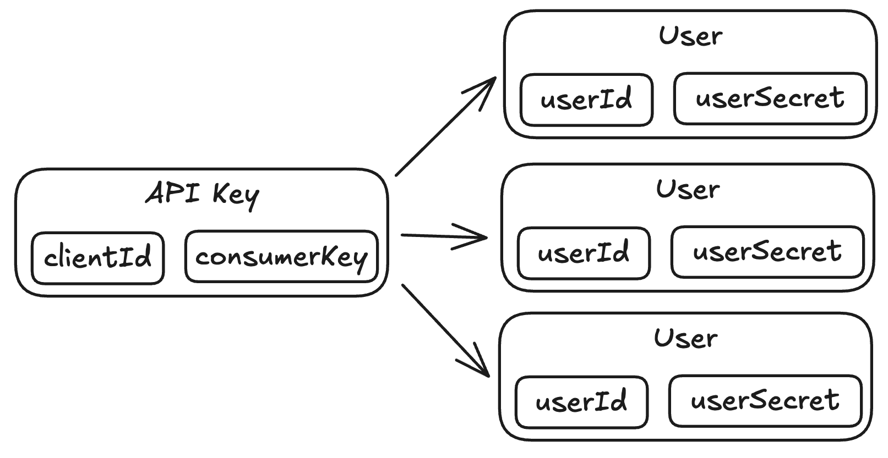
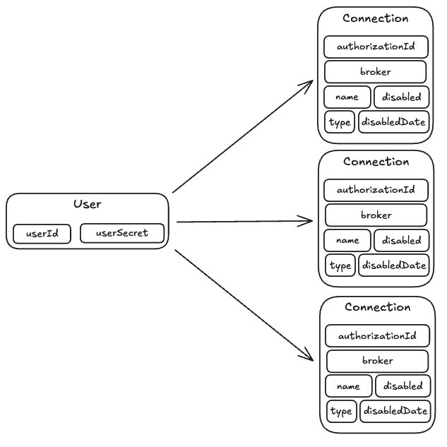
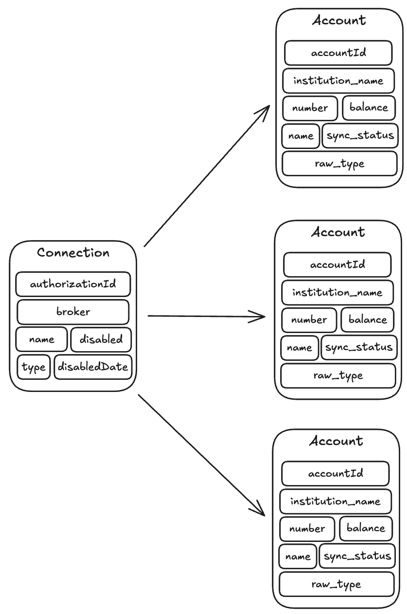
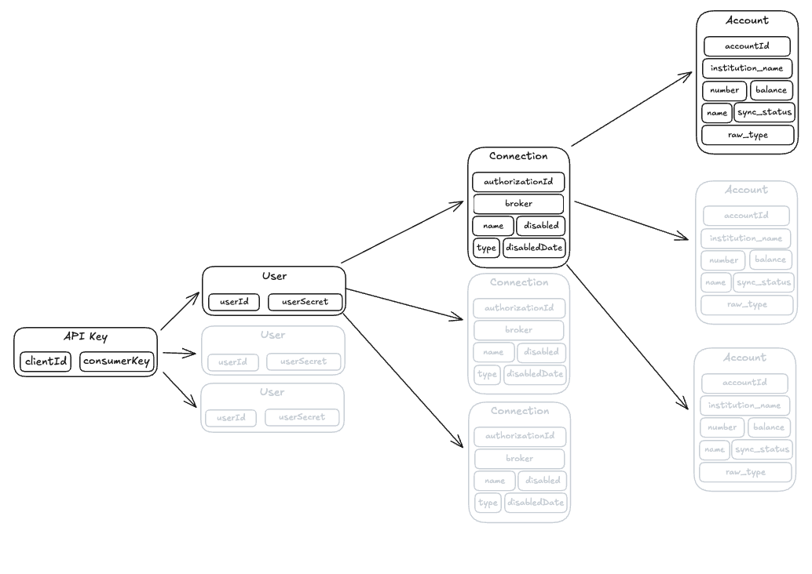

# Getting Started with SnapTrade

## Introduction

Welcome to SnapTrade! This is intended to be one of the first documents you read when learning how to use the SnapTrade API and will answer many questions you might have while getting started. This document when read from top-to-bottom is also a guide for making your first connection, and will get you set up to start pulling account data and placing trades.

Please see the FAQ of each section, as any questions you might have should be answered there.

If after reading this document you still have questions or need help, please do not hesitate to contact us at [support@snaptrade.com](mailto:support@snaptrade.com) or through our [Discord](https://discord.gg/UDwzZUuQ).

For a live demo, see the [Getting Started Demo](https://docs.snaptrade.com/demo/getting-started).

---

## API Keys

Your `API key` consists of a `clientId` and `consumerKey`. Please note that your `consumerKey` is sensitive information and should be kept secure at all times. This `API key` is used to make any requests to the SnapTrade API, and is the first thing required to get started.

### How to: Create a new API Key

When you are ready to get started with SnapTrade and want to start making requests to our API, you will need to create your free and paid `API keys`. You may create only your free key if preferred.

1. Create a SnapTrade account at the [SnapTrade Dashboard](https://dashboard.snaptrade.com/home).
2. Verify your email (You cannot create any `API Keys` until your account is verified).
3. Generate your free `API Key` through the [SnapTrade Dashboard](https://dashboard.snaptrade.com/api-key).
4. [OPTIONAL] Add a payment method through the Settings > Billing page of the [SnapTrade Dashboard](https://dashboard.snaptrade.com/settings/billing).
5. [OPTIONAL] Upgrade to Pay-as-you-Go through Settings > Billing page of the [SnapTrade Dashboard](https://dashboard.snaptrade.com/settings/billing).
6. [OPTIONAL] Generate your paid `API Key` through the [SnapTrade Dashboard](https://dashboard.snaptrade.com/api-key).

After completing these steps, you will have two SnapTrade `API Keys`:

- A free `API Key` that limits the number of concurrent connections.
- Optionally, a paid `API Key` that allows for unlimited connections.

These two `API keys` are essentially the same in terms of functionality, and the core difference between them is that the free `API key` is limited in terms of the number of concurrent connections you can have. You can use these `API keys` to make requests to the SnapTrade API.

### How to: Make a request to the SnapTrade API

When you have an `API Key` and want to start using the SnapTrade API, you will need to use your `API Key` to make requests to the SnapTrade API.

1. With your Free `API Key`, enter your `clientId` and `consumerKey` into the corresponding fields of :api[ApiStatus_check].
2. Press ‘Send’.

In the box below the ‘request’ you should receive a response from the SnapTrade API. The :api[ApiStatus_check] endpoint is the most basic request you can make to the SnapTrade API.

You can also make this request with any of the SnapTrade SDKs.

### SnapTrade SDKs

| **Language** | **SDK Link** |
| --- | --- |
| Python | [**https://pypi.org/project/snaptrade-python-sdk**](https://pypi.org/project/snaptrade-python-sdk) |
| TypeScript | [**https://www.npmjs.com/package/snaptrade-typescript-sdk**](https://www.npmjs.com/package/snaptrade-typescript-sdk) |
| Java | [**https://central.sonatype.com/artifact/com.konfigthis/snaptrade-java-sdk**](https://central.sonatype.com/artifact/com.konfigthis/snaptrade-java-sdk) |
| Ruby | [**https://rubygems.org/gems/snaptrade**](https://rubygems.org/gems/snaptrade) |
| C# | [**https://nuget.org/packages/SnapTrade.Net**](https://nuget.org/packages/SnapTrade.Net) |
| PHP | [**https://packagist.org/packages/konfig/snaptrade-php-sdk**](https://packagist.org/packages/konfig/snaptrade-php-sdk) |
| Go | [**https://pkg.go.dev/github.com/passiv/snaptrade-sdks/sdks/go**](https://pkg.go.dev/github.com/passiv/snaptrade-sdks/sdks/go) |

### API Keys FAQ

- **I have lost the consumerKey to my API Key. What should I do?**
  - You should reach out to SnapTrade support. If it is compromised, your users are still safe due to also requiring a user secret to get account data or place trades.
- **I am getting a 'Unable to verify signature sent' error when hitting the API. What should I do?**
  - The API request is failing when comparing the expected signature to the signature provided by your client. This can happen for many reasons, but is likely caused by attempting to configure the signature without an SDK, or an invalid consumerKey. If you need to reset your consumerKey, reach out to someone at SnapTrade.

---

## Users

Your `API key` will be used to manage a set of SnapTrade `users`. A SnapTrade `user` consists of a `userId` and a `userSecret`. The `userSecret` is a randomly generated string and is sensitive information. It should be kept secure at all times.

Typically if you have an application that manages end-users, each end-user of your application will get one SnapTrade `user` that will be used to manage that end-user’s `connections`. This way, SnapTrade `users` will be one-to-one with the end-users of your application.

### How to: Create a new SnapTrade User

When you have a working `API Key` and want to create a new `connection` for a `user`, you will first need to register a SnapTrade `user`.

1. Using your API Key, create a request to the :api[Authentication_registerSnapTradeUser] endpoint. You will need to provide a unique SnapTrade `userId` . This can be anything that is immutable. For this reason, it is recommended to NOT use email addresses for a SnapTrade `userId`.
2. The response you receive from the SnapTrade API will contain the `userId` you provided and the `userSecret` generated by SnapTrade. The `userSecret` is a randomly generated string and is sensitive information.

You can list your created users by using the :api[Authentication_listSnapTradeUsers] endpoint, and you can delete created users by using the :api[Authentication_deleteSnapTradeUser] endpoint. If needed, you may reset a user’s userSecret by using the :api[Authentication_resetSnapTradeUserSecret] endpoint. Now that you have one or more SnapTrade `users` under your `API Key`, you are ready to create `connections` under these `users`.

### Users FAQ

- **I have lost the userSecret to one of my SnapTrade users. What should I do?**
  - If you lose the userSecret the easiest thing to do is create a new user and ask the end user to reconnect.
- **The userSecret to one of my SnapTrade users has been compromised. What should I do?**
  - The best thing to do in this case is to rotate the user secret using :api[Authentication_resetSnapTradeUserSecret].

---

## Connections

Each `user` under your SnapTrade API key will be used to create and manage `connections` associated with that user. Each connection is associated one-to-one with a set of credentials to an institution.

💡

**Note**: The terms `Connections` and `Brokerage Authorizations` are interchangeable. In most documents, the term `connection` is used.

### How to: Create a new connection for a user

When you have a SnapTrade user and want to get access to their account data and/or place trades for an account, you will need to create a `connection` for that user.

1. Generate a new redirectURI for the SnapTrade Connection Portal using :api[Authentication_loginSnapTradeUser]
3. Open the generated link. Depending on your application, there are different ways to open this link. See [Methods to Integrate the Connection Portal into Your Application](https://docs.snaptrade.com/docs/implement-connection-portal).

Once you have successfully completed the Connection Portal Flow, you should have an active connection to work with, and should have access to the accounts under that connection.

### Connections FAQ

- **How do I enable connecting to 'X' broker on my API Key?**
  - By default, all brokers which can be enabled for you are enabled. For now, broker configuration is done manually on our end. Certain brokers require an application to enable the integration (Alpaca, Tradier, Tradestation, Questrade, Fidelity). Please reach out if you need access to one of these.

---

## Accounts

When you create a `connection`, SnapTrade will automatically sync all `accounts` under the set of credentials to the brokerage. For example, if you made a new `connection` to Questrade (a Canadian brokerage) and that `connection` had a TFSA, an RRSP and an FHSA account under those credentials, SnapTrade would make all these `accounts` accessible over the SnapTrade API.

Once you have a connected `account`, you are ready to move on to pulling account data, and placing trades for that account.

### How to: Get positions for an account

When you have at least one connected `account` and want to start making use of the `positions`, you will first need to get the `accountId`.

1. You can find the `accountId` anywhere over the API where the `account` object is returned. In this example, use the :api[AccountInformation_listUserAccounts] endpoint to get the `accountId` of the account you wish to pull `positions` for.
2. With the `accountId`, call :api[AccountInformation_getUserAccountPositions]. This will return a list of positions in the specified account.

Once you have `positions` returned, you’re able to make use of the data in analysis, monitoring, or another use-case you might be interested in. Other core endpoints for retrieving account information include :api[AccountInformation_getUserAccountBalance] and :api[AccountInformation_getUserAccountOrders].

### How to: Place a checked trade for an account

When you have at least one connected `account` and want to place a trade in the account, you will need to follow these steps to place a checked order. Note that you may also place an order without checking it.

1. You need to get the `universalSymbolId` for the instrument that you wish to place an order for. You can find this using :api[Trading_getUserAccountQuotes].
2. Validate the order with :api[Trading_getOrderImpact]. This is a safe way to check the impact that the trade will have on the account if it is executed, and this is recommended to show on a screen to your user to have them confirm the order. Save the `tradeId` returned by this endpoint, it will be used in the next step. This `tradeId` will expire after a few minutes.
3. Using the `tradeId` returned from :api[Trading_getOrderImpact], place the checked order using :api[Trading_placeOrder]. This will place the order at the brokerage for the account, and return the response given by the broker.

The order will now show over the :api[AccountInformation_getUserAccountOrders] endpoint. If it does not, you may need to trigger a refresh for the connection using :api[Connections_refreshBrokerageAuthorization].

### Accounts FAQ

- **My account data is stale, why is my account not syncing every day?**
  - The connection is probably disabled, this happens when the access token is no longer valid. Please check using the :api[Connections_detailBrokerageAuthorization] and follow [this guide](https://docs.snaptrade.com/docs/fix-broken-connections) to repair the connection.
- **When does the account data actually get synced daily?**
  - It is not consistent at the same time every day, but guaranteed once per day.

---

## Next Steps

- To get started with Webhooks, see [Webhooks](https://docs.snaptrade.com/docs/webhooks)
- To get started with implementing the SnapTrade Connection Portal, see [Methods to Integrate the Connection Portal into Your Application](https://docs.snaptrade.com/docs/implement-connection-portal)
