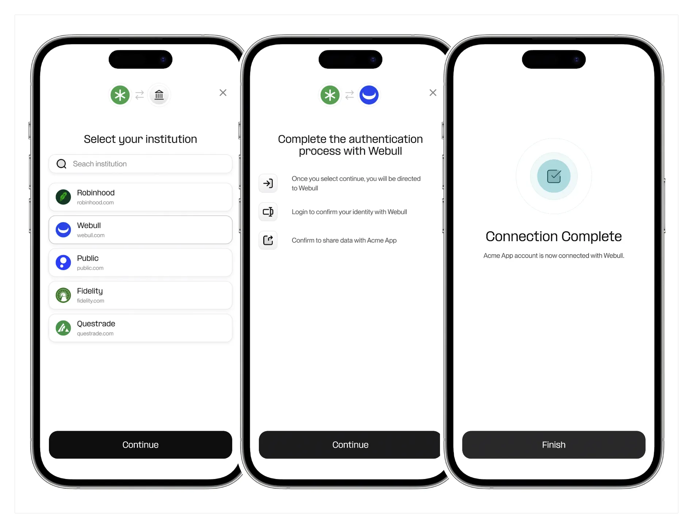
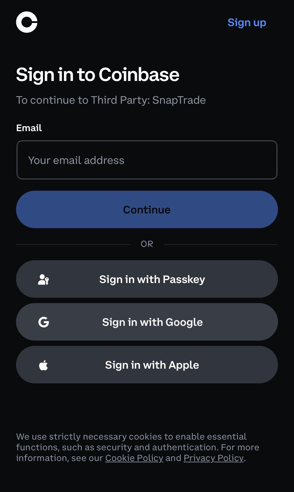
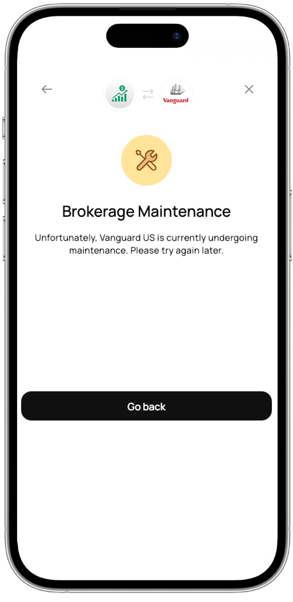

# Connection Portal

## Overview

The Connection Portal is the front-end interface your users interact with to link their brokerage accounts to the SnapTrade API.



### Introduction

The Connection Portal is a drop-in UI that lets your users link brokerage accounts to the SnapTrade API. It handles credential entry, MFA, reconnects, and redirects, so your app only needs to open a connection portal link and and process the connection result when users are returned to your app.

SnapTrade’s connection portal is built to run smoothly on all modern browsers and platforms, including:

- Web apps
- Native iOS
- Native Android
- React Native

### Initializing

The SnapTrade connection flow begins when your user shows intent to connect their brokerage account to your app.

1

User taps _Connect Account_ in your app.

Your app calls your backend to generate a SnapTrade connection portal login link and returns it to the client.

---

2

Your app opens the SnapTrade connection portal login link for the user (see [Integration Methods for platform-specific best practices](#integration-methods)).

They select their brokerage and go through the login flow.

---

3

After successfully connecting, SnapTrade redirects the user back to your app.

---

4

Your backend can now fetch and store the connection details and use them to make necessary API requests for the user.

### Login Link Parameters

- **connectionType (optional):** Sets the level of access requested. Defaults to `read`.
  - `read`: Data access only
  - `trade`: Data + trading access
  - `trade-if-available`: Requests trading access if supported; otherwise falls back to `read`

- **broker (optional) - broker slug:** If you display broker options in your own UI instead of using SnapTrade’s built-in selection screen, pass the broker slug here. This skips the integrations selection screen and goes directly into that brokerage’s login flow. See the [integrations page](https://support.snaptrade.com/brokerages-table)
- **customRedirect (optional):** Override the default redirect URL for this session.
- **immediateRedirect (optional, boolean):** If true, skips the Connection Portal’s success or error screen and sends the user straight back to your app after the connection attempt, using either the default or custom redirect URL.
- **reconnect (required for reconnect flow):** The UUID of a connection that needs to be re-established. Leave this empty unless you are explicitly reconnecting a disabled connections.
- **showCloseButton (optional, boolean):** Set to `false` to hide the close (X) button. Useful for mobile implementations where the native WebView or browser already provides a close button. Defaults to `true`.

## Integration Methods

You can display the Connection Portal in your application using one of the following methods. Pick one method depending on platform and UX needs.

### Embedded iframe (recommended for web apps)

Displays the portal within your application using an iframe.

**Best for:** Web apps - Keeping users within your app, better user experience, when you want full control over the flow.

- Example React snippet:

```jsx
const ConnectionPortalModal = ({ loginLink }) => (
  <Modal title="SnapTrade Connection Portal" visible footer={null}>
    <iframe
      id="snaptrade-connection-portal"
      src={loginLink}
      title="SnapTrade Connection Portal"
      style={{ width: "100%", height: "70vh", border: 0 }}
      sandbox="allow-forms allow-scripts allow-same-origin allow-popups"
      referrerPolicy="no-referrer"
      allow="clipboard-read; clipboard-write"
      aria-label="SnapTrade connection portal"
    />
  </Modal>
);
```

- Key Considerations:
  - Find guidance on how to monitor window messages [here](#implement-connection-portal-window-messages).
  - Your application is responsible for closing the iframe modal post connections.
  - If not using `snaptrade-react` SDK, you must handle responsive sizing and closing the modal. The SDK simplifies this.

:::info
For React applications, we recommend using our `snaptrade-react` SDK which offers a seamless integration process. For installation and setup instructions, refer to [SnapTrade React SDK on npm](https://www.npmjs.com/package/snaptrade-react). The SDK provides built-in callbacks that allow you to use client-side window messages for monitoring successful connections or failures, ensuring a smoother user experience.
:::

### New Browser Tab

Opens the portal in a separate browser tab or popup window.

**Best for:** Web apps - Straightforward connection flows.

- Key Considerations:
  - To determine the connection state, your application can use one of the following approaches:
    - **Option 1: Window messages**
      - Open the Connection Portal in a new window using `window.open`. This is required to receive client-side window messages.
      - Refer to the documentation on how to listen for and handle these messages [here](#implement-connection-portal-window-messages).
    - **Option 2: Query parameters in redirect**
      - The portal will redirect back to your URL with query parameters:
        - **SUCCESS:** `{your_redirect_url}?status=SUCCESS&connection_id={connection_id}`
        - **ERROR:** `{your_redirect_url}?status=ERROR&status_code={status_code}&error_code={error_code}`
        - **ABANDONED:** `{your_redirect_url}?status=ABANDONED`
  - You can provide a custom redirect to navigate the user back to a specific page in your app post-connection.
  - Set `immediateRedirect` to true in the login link to skip the connection portal’s internal finish screens and redirect immediately.

### Mobile In-app Browser (Recommended for mobile apps)

Use _SFSafariViewController_ on iOS, _Chrome Custom Tabs_ on Android, or the recommended in-app browser library for React Native. This preserves browser features required by OAuth and Passkeys.

**Best for:** Mobile applications (React Native, native iOS/Android apps, etc.)

**Implementation guides:**

- [React Native](#implement-connection-portal-react-native)
- [iOS](#implement-connection-portal-native-ios)
- [Android](#implement-connection-portal-native-android)

## Window messages

We send these [window messages](https://developer.mozilla.org/en-US/docs/Web/API/Window/message_event) to notify your app about user actions and the status of the connection attempt.

Your app should listen for these messages and respond accordingly, for example by showing toast notifications, performing redirects, or running any other app logic that makes sense for your use case.

- Messages
  - **SUCCESS:** Indicates successful institution connection. The message contains the authorization ID (same as connection id).

  ```
  {status: 'SUCCESS', authorizationId: 'AUTHORIZATION_ID'}
  ```

  - **ERROR:** Sent when a connection error occurs, including an error code, status code and description.

  ```
  {status: 'ERROR', errorCode: 'ERROR_CODE', statusCode: 'STATUS_CODE', detail: 'DETAIL_OF_THE_ERROR'}
  ```

  - **CLOSED:** Sent when the user manually closes the OAuth connection window that opens in a new tab.
    - Note: This message is only emitted when the connection portal is loaded inside an iframe. In other integration methods, the OAuth flow opens in the same tab as the connection portal, so closing the OAuth window also ends the entire connection portal session.

  - **ABANDONED:** Functions the same as `CLOSE_MODAL` but only triggers for non-iframe implementations.
    - Example React snippet:

    ```jsx
    useEffect(() => {
      const handleMessageEvent = (e) => {
        if (e.data) {
          const data = e.data;

          if (data.status === "SUCCESS") {
            const authorizationId = data.authorizationId;
            // close the connection portal/modal and display success message to the user
          } else if (data.status === "ERROR") {
            const { errorCode, statusCode, detail } = data;
            // close the connection portal/modal and display error message to the user
          } else if (
            data === "CLOSED" ||
            data === "CLOSE_MODAL" ||
            data === "ABANDONED"
          ) {
            // close the modal
          }
        }
      };

      window.addEventListener("message", handleMessageEvent, false);

      return () => {
        window.removeEventListener("message", handleMessageEvent, false);
      };
    }, []);
    ```

## React Native

Authentication Flow: `[Your App] → [In-App Browser] → [SnapTrade Auth] → [Redirect] → [Your App]`

### Redirect URL Parameters

SnapTrade redirects back to your app with these parameters:

- **Success:**
  - `status=SUCCESS`
  - `connection_id=<string>` - The connection ID to use for API calls

- **Error:**
  - `status=ERROR`
  - `error_code=<string>` - Error code describing what went wrong
  - `status_code=<number>` - HTTP status code

### Expo

1. Configure URL scheme in `app.config.json` or `app.json`:

```js
export default {
  expo: {
    scheme: "yourapp",
    // ... other config
  },
};
```

2. Install Dependencies

```bash
npx expo install expo-web-browser expo-linking
```

3. Rebuild the app after adding URL schemes

```bash
npx expo prebuild --clean
npx expo run:ios
npx expo run:android
```

4. Basic implementation

```tsx
import * as WebBrowser from "expo-web-browser";
import * as Linking from "expo-linking";
import { useEffect } from "react";

function SnapTradeConnect() {
  // Handle incoming deep links
  useEffect(() => {
    // Handle deep link when app is already open
    const subscription = Linking.addEventListener("url", handleDeepLink);

    // Handle deep link when app opens from closed state
    Linking.getInitialURL().then((url) => {
      if (url) handleDeepLink({ url });
    });

    return () => subscription.remove();
  }, []);

  const handleDeepLink = (event) => {
    const { url } = event;
    const { queryParams } = Linking.parse(url);

    // Dismiss the in-app browser
    WebBrowser.dismissBrowser();

    // Handle the callback
    if (queryParams.status === "SUCCESS") {
      console.log("Connection successful!", queryParams.connection_id);
      // Save connection_id and proceed with your flow
    } else if (queryParams.status === "ERROR") {
      console.error("Connection failed:", queryParams.error_code);
      // Show error to user
    }
  };

  const openSnapTrade = async () => {
    const snaptradeUrl = "YOUR_SNAPTRADE_LOGIN_LINK";

    try {
      await WebBrowser.openBrowserAsync(snaptradeUrl);
    } catch (error) {
      console.error("Failed to open browser:", error);
    }
  };

  return <Button onPress={openSnapTrade}>Connect Account</Button>;
}
```

### Vanilla React Native

1. Configure URL scheme:

- iOS: Add to `Info.plist`

```
<key>CFBundleURLTypes</key>
<array>
  <dict>
    <key>CFBundleURLSchemes</key>
    <array>
      <string>yourapp</string>
    </array>
  </dict>
</array>

```

- Android: Add to `AndroidManifest.xml`

```
<intent-filter>
  <action android:name="android.intent.action.VIEW" />
  <category android:name="android.intent.category.DEFAULT" />
  <category android:name="android.intent.category.BROWSABLE" />
  <data android:scheme="yourapp" />
</intent-filter>
```

2. Install Dependencies

```bash
npm install react-native-inappbrowser-reborn\
```

3. Basic Implementation

```tsx
import InAppBrowser from "react-native-inappbrowser-reborn";
import { Linking } from "react-native";
import { useEffect } from "react";

function SnapTradeConnect() {
  useEffect(() => {
    const handleDeepLink = (event) => {
      const url = event.url;
      const params = parseUrl(url);

      if (params.status === "SUCCESS") {
        console.log("Connection successful!", params.connection_id);
      } else if (params.status === "ERROR") {
        console.error("Connection failed:", params.error_code);
      }
    };

    const subscription = Linking.addEventListener("url", handleDeepLink);

    Linking.getInitialURL().then((url) => {
      if (url) handleDeepLink({ url });
    });

    return () => subscription.remove();
  }, []);

  const openSnapTrade = async () => {
    const snaptradeUrl = "YOUR_SNAPTRADE_LOGIN_LINK";

    try {
      if (await InAppBrowser.isAvailable()) {
        await InAppBrowser.open(snaptradeUrl);
      }
    } catch (error) {
      console.error("Failed to open browser:", error);
    }
  };

  const parseUrl = (url) => {
    const urlObj = new URL(url);
    const params = {};
    urlObj.searchParams.forEach((value, key) => {
      params[key] = value;
    });
    return params;
  };

  return <Button onPress={openSnapTrade}>Connect SnapTrade Account</Button>;
}
```

## Native iOS

Authentication Flow: `[Your App] → [In-App Browser] → [SnapTrade Auth] → [Redirect] → [Your App]`

### Redirect URL Parameters

SnapTrade redirects back to your app with these parameters:

- **Success:**
  - `status=SUCCESS`
  - `connection_id=<string>` - The connection ID to use for API calls

- **Error:**
  - `status=ERROR`
  - `error_code=<string>` - Error code describing what went wrong
  - `status_code=<number>` - HTTP status code

### Implementation

1. Configure URL scheme in `Info.plist` :

```swift
<key>CFBundleURLTypes</key>
<array>
  <dict>
    <key>CFBundleURLSchemes</key>
    <array>
      <string>yourapp</string>
    </array>
  </dict>
</array>

```

2. Basic implementation

```swift
import SafariServices

class ViewController: UIViewController {

    func openSnapTrade() {
        guard let url = URL(string: "YOUR_SNAPTRADE_LOGIN_LINK") else { return }

        let safariVC = SFSafariViewController(url: url)

        present(safariVC, animated: true)
    }
}

// In AppDelegate.swift or SceneDelegate.swift
func application(_ app: UIApplication,
                 open url: URL,
                 options: [UIApplication.OpenURLOptionsKey : Any] = [:]) -> Bool {

    // Dismiss Safari View Controller
    if let presented = UIApplication.shared.windows.first?.rootViewController?.presentedViewController as? SFSafariViewController {
        presented.dismiss(animated: true)
    }

    // Parse URL
    guard let components = URLComponents(url: url, resolvingAgainstBaseURL: true),
          let queryItems = components.queryItems else {
        return false
    }

    let params = queryItems.reduce(into: [String: String]()) { result, item in
        result[item.name] = item.value
    }

    // Handle callback
    if params["status"] == "SUCCESS",
       let connectionId = params["connection_id"] {
        print("Connection successful: \\(connectionId)")
        // Save connection_id and proceed
    } else if params["status"] == "ERROR",
              let errorCode = params["error_code"] {
        print("Connection failed: \\(errorCode)")
        // Show error to user
    }

    return true
}

// For iOS 13+ with SceneDelegate
func scene(_ scene: UIScene,
           openURLContexts URLContexts: Set<UIOpenURLContext>) {
    guard let url = URLContexts.first?.url else { return }
    // Handle URL same as above
}
```

## Native Android

Authentication Flow: `[Your App] → [In-App Browser] → [SnapTrade Auth] → [Redirect] → [Your App]`

### Redirect URL Parameters

SnapTrade redirects back to your app with these parameters:

- **Success:**
  - `status=SUCCESS`
  - `connection_id=<string>` - The connection ID to use for API calls

- **Error:**
  - `status=ERROR`
  - `error_code=<string>` - Error code describing what went wrong
  - `status_code=<number>` - HTTP status code

### Implementation

1. Configure URL scheme in `AndroidManifest.xml`, add to your main Activity:

```kotlin
<activity android:name=".MainActivity">
    <intent-filter>
        <action android:name="android.intent.action.VIEW" />
        <category android:name="android.intent.category.DEFAULT" />
        <category android:name="android.intent.category.BROWSABLE" />
        <data android:scheme="yourapp" />
    </intent-filter>
</activity>
```

2. Basic implementation

```kotlin
import android.net.Uri
import androidx.browser.customtabs.CustomTabsIntent

class MainActivity : AppCompatActivity() {

    override fun onCreate(savedInstanceState: Bundle?) {
        super.onCreate(savedInstanceState)

        // Handle incoming deep link
        handleIntent(intent)
    }

    override fun onNewIntent(intent: Intent?) {
        super.onNewIntent(intent)
        intent?.let { handleIntent(it) }
    }

    private fun handleIntent(intent: Intent) {
        val data: Uri? = intent.data

        data?.let { uri ->
            val status = uri.getQueryParameter("status")
            val connectionId = uri.getQueryParameter("connection_id")
            val errorCode = uri.getQueryParameter("error_code")

            when (status) {
                "SUCCESS" -> {
                    println("Connection successful: $connectionId")
                    // Save connection_id and proceed
                }
                "ERROR" -> {
                    println("Connection failed: $errorCode")
                    // Show error to user
                }
            }
        }
    }

    fun openSnapTrade() {
         val url = "YOUR_SNAPTRADE_LOGIN_LINK"
         CustomTabsIntent.Builder()
	         .build()
	         .launchUrl(this, Uri.parse(url))
    }
}
```

## Troubleshooting

### Coinbase Mobile Authentication Issues

- Problem: Coinbase uses OAuth and supports Passkeys, Google, and Apple sign-in. When the portal runs inside a mobile WebView, Passkey and Google sign-in often fail. WebViews impose restrictions on third-party cookies, credential delegation, and embedded authentication flows. This breaks modern auth flows.
- Solution: We recommend using in-app browser for all integrations. It’s more secure and avoids problems like this.



## Brokerage Connectivity Issue Screen

- What it looks like: Users see a connectivity warning before reaching the login page for a specific brokerage.

- Why it happens: SnapTrade detects degraded connectivity to that brokerage. Some users may still connect, but analytics show an unhealthy success rate.
- How to handle:
  - For users: Recommend trying again later if they cannot connect.
  - For developers: No code changes are required. This is an automatic protection against poor user experience.

## Brokerage Under Maintenance Screen

- What it looks like: A warning that the selected brokerage is temporarily unavailable and the connection cannot proceed right now.

  

- Why it happens:
  - The brokerage is in scheduled or unscheduled maintenance.
  - SnapTrade is experiencing degraded connectivity to the broker, preventing the creation of any new connections.

- How to handle:
  - For users: Recommend trying again later when the maintenance window is over.
  - For developers: No code changes required. SnapTrade automatically re-enables connections when the brokerage or our service recovers.
