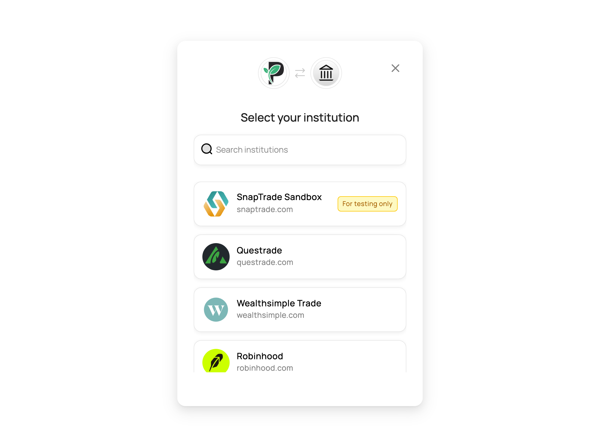

# Sandbox

A simulated brokerage for exercising your integration end-to-end — connection flow, accounts, balances, holdings, orders, and transactions — without a real brokerage login. It returns deterministic data and lets you trigger specific success and failure outcomes.

## Getting access

- Sandbox is available on **non-production** keys — both **personal keys** and **commercial test keys** — and is **enabled by default**, so there's nothing to request.
- It is **not available on commercial production keys**, and can't be enabled on them.
- In the connection portal it's flagged **For testing only** — pinned to the **top** of the institution list on commercial test keys, and shown at the **bottom** on personal keys.

## Connecting

1. Generate a Connection Portal URL as usual (`loginSnapTradeUser`) and use a **read** connection type. Optionally pass `broker=SANDBOX` to jump straight past the institution list, skipping step 2.
2. Select **Sandbox**.
3. Pick a **scenario** to simulate → **Connect**.

## Scenarios

**Data — connection succeeds:**

- **Self-directed** (default) → 2 funded accounts with positions, orders, and transaction history
- **Cash only** → 1 cash account, no holdings
- **No transactions** → accounts with positions but no activity history
- **No accounts** → succeeds but returns zero accounts

**Errors — connection fails:**

- **Invalid credentials** → invalid-credentials error
- **Account locked** → account-locked error
- **Rate limited** → rate-limit error

## What the data covers (data scenarios)

- Accounts, balances (cash + buying power), and positions across a handful of well-known tickers
- Orders spanning every status — executed, partially filled, accepted, canceled, rejected
- Transactions spanning **trades**, **cash & fees**, **dividends & income**, **corporate actions**, and **transfers** (see the full list of types below)
- In the default **Self-directed** scenario these are **spread across the two accounts** (e.g. splits & dividends on one, transfers & mergers on the other) — iterate **all** accounts to see the full set

<b>All transaction types</b>

These are the normalized `type` values SnapTrade maps real brokerage transactions to (the Sandbox exercises most of them across its data scenarios). The list is **not exhaustive**: when a brokerage transaction doesn't map to one of these, SnapTrade returns the raw type the brokerage uses, so treat `type` as open-ended and lean on `amount`, `units`, `price`, and `symbol` where you can.

| Category | Type | Description |
| --- | --- | --- |
| Trades | `BUY` | Asset bought. |
| Trades | `SELL` | Asset sold. |
| Cash & fees | `CONTRIBUTION` | Cash contribution (deposit) into the account. |
| Cash & fees | `WITHDRAWAL` | Cash withdrawal from the account. |
| Cash & fees | `INTEREST` | Interest deposited into the account. |
| Cash & fees | `FEE` | Fee withdrawn from the account. |
| Cash & fees | `TAX` | A tax-related fee. |
| Cash & fees | `REBATE` | A rebate credited to the account. |
| Dividends & income | `DIVIDEND` | Dividend payout. |
| Dividends & income | `REI` | Dividend reinvestment. |
| Dividends & income | `STOCK_DIVIDEND` | Dividend distributed as shares instead of cash. |
| Dividends & income | `RETURN_OF_CAPITAL` | Return of capital distribution. |
| Dividends & income | `DISTRIBUTION` | A distribution paid into the account. |
| Options | `OPTIONEXPIRATION` | Option expiration event. |
| Options | `OPTIONASSIGNMENT` | Option assignment event. |
| Options | `OPTIONEXERCISE` | Option exercise event. |
| Corporate actions | `SPLIT` | A stock share split. |
| Corporate actions | `REVERSE_SPLIT` | A reverse stock share split. |
| Corporate actions | `SPINOFF` | Shares received from a corporate spinoff. |
| Corporate actions | `STOCK_MERGER` | Shares resulting from a merger. |
| Corporate actions | `ADJUSTMENT` | A one-time adjustment of the account's cash balance or shares of an asset. |
| Transfers | `TRANSFER` | Transfer of asset(s) from one account to another. |
| Transfers | `EXTERNAL_ASSET_TRANSFER_IN` | Incoming transfer of an asset from an external account. |
| Transfers | `EXTERNAL_ASSET_TRANSFER_OUT` | Outgoing transfer of an asset to an external account. |
| Transfers | `INTERNAL_CASH_TRANSFER_IN` | Incoming cash transfer between your own accounts. |
| Transfers | `INTERNAL_CASH_TRANSFER_OUT` | Outgoing cash transfer between your own accounts. |
| Transfers | `INTERNAL_ASSET_TRANSFER_IN` | Incoming asset transfer between your own accounts. |
| Transfers | `INTERNAL_ASSET_TRANSFER_OUT` | Outgoing asset transfer between your own accounts. |

## Limitations

- **Read-only** — placing/canceling trades isn't supported, and Sandbox won't appear in **trade-only** connection sessions
- Data is **static and simulated** (timestamps are relative to the current time)
